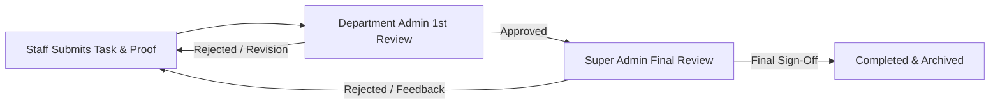

# 🎓 CT University Task Manager

<div align="center">

[](https://reactjs.org/)
[](https://www.typescriptlang.org/)
[](https://vitejs.dev/)
[](https://nodejs.org/)
[](https://www.mongodb.com/)
[](https://jwt.io/)

**An enterprise-grade, multi-tier task delegation, workflow orchestration, and NAAC administrative tracking platform built specifically for CT University.**

[Key Features](#-key-features) • [System Architecture](#-system-architecture) • [Role Workflows](#-role-based-workflows) • [Getting Started](#-getting-started) • [API Reference](#-api-endpoints) • [Default Credentials](#-default-test-credentials)

</div>

---

## 📌 Overview

The **CT University Task Manager** is a centralized administrative platform engineered to streamline institutional workflows, manage departmental hierarchies, automate task approval cycles, and track NAAC accreditation KPIs. It bridges the gap between top-level university leadership, department heads, and operational staff through transparent delegation, dynamic urgency indicators, and real-time performance analytics.

---

## 🌟 Key Features

### 👑 1. Super Admin Control Suite
* **Global Task Governance**: Create, delegate, and monitor institutional tasks across all departments.
* **NAAC Analytics & KPI Dashboard**: Real-time visualization of task completion rates, departmental performance leaderboards, and accreditation readiness charts powered by Recharts.
* **Department Management**: Dynamically configure and manage university departments and administrative units.
* **Staff-to-Admin Hierarchy Mapping**: Flexibly assign and reallocate staff members under specific Department Admins.
* **Verified User Whitelisting**: Bulk import faculty/staff rosters via Excel (`.xlsx`/`.csv`) to authorize pre-verified university IDs.
* **User & Role Administration**: Full control over user accounts, role escalations (`super_admin`, `department_admin`, `staff`), and account activation states.

### 🏛️ 2. Department Admin Hub
* **Departmental Delegation**: Create and assign specialized tasks to team members within the department.
* **First-Stage Review**: Review deliverables and work submitted by staff before escalating to university leadership.
* **Team Staff Roster**: Real-time visibility into active department staff, individual workloads, and completion metrics.
* **Multi-Assignee Support**: Distribute tasks to single or multiple staff members simultaneously.

### 🧑‍💼 3. Staff Workspace
* **Personal Task Dashboard**: Intuitive card layout categorizing pending, in-progress, under-review, and completed tasks.
* **Subtask Tracking**: Break down large deliverables into actionable checklist milestones with automated progress bar calculation.
* **Deliverables Submission**: Upload verification documents, reports, and attachments for review.
* **Performance Profile**: View personal performance metrics, completed task history, and administrative rating.

### ⚡ 4. Dynamic Urgency & Smart Statuses
Intelligent color-coded badges that calculate remaining time until the deadline:
* 🔴 **Critical / Overdue**: Deadline within **≤ 5 days** or already passed.
* 🟡 **Warning**: Deadline between **6 and 10 days**.
* 🟢 **Healthy**: Deadline is **> 10 days** away.

### 🔄 5. Multi-Stage Approval Pipeline


---

## 💻 Tech Stack

### Frontend
| Technology | Description |
| :--- | :--- |
| **React 19** | Modern declarative UI component library |
| **TypeScript** | Type-safe development across all components and API services |
| **Vite 6** | Next-generation frontend build tooling and fast HMR |
| **React Router 7** | Client-side routing with role-based protected routes |
| **Recharts** | Interactive data visualization for NAAC reports and performance charts |
| **Lucide React** | Consistent, modern icon set |
| **Vanilla CSS** | Modular, responsive styling with clean glassmorphism accents |

### Backend & Database
| Technology | Description |
| :--- | :--- |
| **Node.js & Express** | RESTful API server with TypeScript support |
| **MongoDB & Mongoose** | Document database with relational referencing and auto-indexing |
| **JWT & Bcrypt** | Secure token-based authentication and salted password hashing |
| **Multer** | Multipart form handling for file uploads & Excel roster imports |
| **XLSX** | Spreadsheet parsing for bulk verified user onboarding |

---

## 🏗️ Project Architecture

```text
ct-task-manager/
├── backend/                       # Express + TypeScript Server
│   ├── src/
│   │   ├── config/                # Database connection & environment configs
│   │   ├── controllers/           # Business logic (auth, tasks, users, files, etc.)
│   │   ├── middleware/            # Auth JWT, Role Authorization, Multer Upload
│   │   ├── models/                # Mongoose Schemas (User, Task, Department, etc.)
│   │   ├── routes/                # Express API Route definitions
│   │   ├── services/              # Helper services
│   │   ├── utils/                 # Utility functions
│   │   └── server.ts              # Express application entrypoint
│   ├── package.json
│   └── tsconfig.json
└── frontend/                      # React + Vite + TypeScript Client
    ├── src/
    │   ├── components/            # Reusable UI (TaskModal, TaskCard, Layouts, Navbars)
    │   ├── context/               # AuthContext & Global State Management
    │   ├── hooks/                 # Custom React hooks
    │   ├── navigation/            # AppRouter & ProtectedRoute configuration
    │   ├── pages/                 # Role-specific views (SuperAdmin, Admin, Staff, NAAC)
    │   ├── services/              # Axios/Fetch API client wrappers
    │   ├── types/                 # Shared TypeScript interfaces & types
    │   ├── utils/                 # Urgency calculation & date helpers
    │   ├── App.tsx
    │   ├── main.tsx
    │   └── index.css              # Global styles & design system tokens
    ├── package.json
    └── vite.config.ts
```

---

## 🚀 Getting Started

### Prerequisites
* **Node.js**: v18.0.0 or higher recommended
* **npm**: v9.0.0 or higher
* **MongoDB**: Local MongoDB instance (`mongodb://localhost:27017`) or MongoDB Atlas URI

---

### 1. Backend Setup

1. Open a terminal and navigate to the backend directory:
   ```bash
   cd backend
   ```

2. Install dependencies:
   ```bash
   npm install
   ```

3. Create a `.env` file in `backend/.env`:
   ```env
   PORT=5000
   MONGODB_URI=mongodb://localhost:27017/ct_task_manager
   JWT_SECRET=your_super_secret_jwt_key_here
   NODE_ENV=development
   ```

4. Start the backend development server:
   ```bash
   npm run dev
   ```
   The backend API will be running at `http://localhost:5000`.

---

### 2. Frontend Setup

1. Open a new terminal and navigate to the frontend directory:
   ```bash
   cd frontend
   ```

2. Install dependencies:
   ```bash
   npm install
   ```

3. Start the Vite development server:
   ```bash
   npm run dev
   ```
   The application will open at `http://localhost:5173`.

---

## 🔐 Default Test Credentials

Use these pre-configured user credentials to test and explore the system:

| Role | University ID | Password | Access Level |
| :--- | :--- | :--- | :--- |
| **👑 Super Admin** | `10001` | `12345678` | Full university-wide access & final task approval |
| **🏛️ Department Admin** | `10002` | `12345678` | Departmental task assignment & 1st review |
| **🧑‍💼 Staff** | `10003` | `12345678` | Task execution, subtasks, & review submissions |

---

## 📡 API Endpoints Summary

### Authentication (`/api/auth`)
* `POST /api/auth/register` — Register a new account (validated against verified user whitelist)
* `POST /api/auth/login` — Authenticate user and receive JWT
* `GET /api/auth/me` — Fetch currently authenticated user details

### Tasks (`/api/tasks`)
* `GET /api/tasks` — List visible tasks with filtering (status, priority, urgency, department, search)
* `POST /api/tasks` — Create a new task (with file attachments)
* `GET /api/tasks/:id` — Retrieve task details and history
* `PATCH /api/tasks/:id` — Update task title, description, or deadline
* `PATCH /api/tasks/:id/assign` — Assign/reassign task members
* `PATCH /api/tasks/:id/status` — Update progress status
* `PATCH /api/tasks/:id/submit-review` — Submit task deliverables for review
* `PATCH /api/tasks/:id/review` — Approve or reject a task review
* `POST /api/tasks/:id/subtasks` — Add a subtask to a task
* `GET /api/tasks/:id/subtasks` — List all subtasks for a parent task
* `GET /api/tasks/:id/progress` — Get aggregated task completion progress
* `GET /api/tasks/naac-report` — Department-wise NAAC accreditation metrics & leaderboard

### User & Hierarchy Management
* `GET /api/users` — Search & list users (Admin/Super Admin)
* `GET /api/users/profile` — Fetch user profile with performance rating
* `PATCH /api/users/:id/role` — Update user permissions (Super Admin)
* `PATCH /api/users/:id/status` — Activate/deactivate user account (Super Admin)
* `GET /api/staff-assignments` — Retrieve staff-to-admin mapping (Super Admin)
* `POST /api/staff-assignments` — Assign staff member to a Department Admin
* `PATCH /api/staff-assignments/:id` — Unassign/deactivate staff relationship

### Verified Users Whitelist (`/api/verified-users`)
* `POST /api/verified-users/import` — Bulk import university roster from Excel (`.xlsx`/`.csv`)
* `GET /api/verified-users/template` — Download sample Excel roster template
* `GET /api/verified-users/stats` — Roster import statistics and counts
* `GET /api/verified-users` — Search and paginate pre-verified personnel

### Departments (`/api/departments`)
* `GET /api/departments` — List all university departments
* `POST /api/departments` — Create new department (Super Admin)
* `DELETE /api/departments/:id` — Remove a department (Super Admin)

---

## 🛡️ Security & Access Control

* **Role-Based Access Control (RBAC)**: Fine-grained middleware ensuring users only access authorized endpoints and data scopes.
* **Pre-Registration Verification**: Users cannot register arbitrary roles without matching an authorized pre-whitelisted University ID.
* **Password Encryption**: Industry-standard Bcrypt hashing with configurable salt rounds.
* **Protected File Access**: File uploads validated for MIME types and stored securely with unique identifiers.

---

## 👥 Roles & Permissions Matrix

| Capability | Super Admin | Department Admin | Staff |
| :--- | :---: | :---: | :---: |
| Global Task Delegation | ✅ | ❌ | ❌ |
| Department Task Delegation | ✅ | ✅ | ❌ |
| Submit Task for Review | ❌ | ❌ | ✅ |
| 1st-Stage Task Review | ✅ | ✅ | ❌ |
| Final Task Sign-Off | ✅ | ❌ | ❌ |
| View NAAC Analytics | ✅ | ✅ | ✅ |
| Manage Departments | ✅ | ❌ | ❌ |
| Bulk Import Staff Roster | ✅ | ❌ | ❌ |
| Manage Staff Assignments | ✅ | ✅ (Own Team) | ❌ |

---

## 🤝 Contributing

Contributions are welcome! If you would like to enhance CT University Task Manager:
1. Fork the repository
2. Create a feature branch (`git checkout -b feature/NewFeature`)
3. Commit your changes (`git commit -m 'Add NewFeature'`)
4. Push to the branch (`git push origin feature/NewFeature`)
5. Open a Pull Request

---

## 📄 License

This project is licensed under the **ISC License**. Developed for academic and institutional workflow management at CT University.
